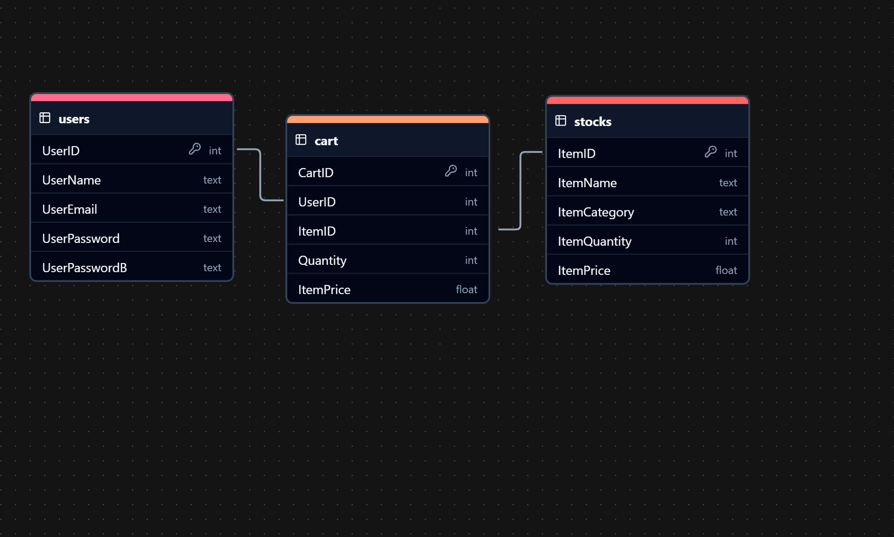

# Trade-Engine eCommerce Backend 

# By Israel Mafabi Emmanuel

## Overview

**Trade-Engine** is a robust backend system for an eCommerce platform. It handles user management, inventory control, shopping cart functionality, and secure transactions using Python and SQLAlchemy.

## Project Structure

```shell
Trade-Engine/
├── dependencies/
│   ├── interfaces/
│   │   ├── admin.py
│   │   ├── main_menu.py
│   │   └── user.py
│   └── helpers.py
├── models/
│   ├── cart.py
│   ├── stock.py
│   └── user.py
├── relationships/
│   ├── ecommerce_relationships_backend.png
│   ├── ecommerce_relationships_backend.svg
├── storage/
│   ├── database/
│   │   └── storage.db
│   └── setup.py
└── main.py
```

### Files and Directories

- **dependencies/**
  - **interfaces/**: Contains the user interfaces for the admin, main menu, and user interactions.
    - **admin.py**: Handles administrative functions such as managing stock and viewing items.
    - **main_menu.py**: Manages the main menu options, including user login, registration, and admin access.
    - **user.py**: Manages user-related functionalities like registration, login, and cart operations.
  - **helpers.py**: Contains utility functions for input sanitization, screen clearing, transitions, and more.
- **models/**
  - **cart.py**: Defines the `Cart` model and methods to handle cart operations.
  - **stock.py**: Defines the `Stock` model and methods for managing inventory.
  - **user.py**: Defines the `User` model and methods for user account management.
- **storage/**
  - **database/**: Stores the SQLite database file `storage.db`.
  - **setup.py**: Handles database setup, including creating the engine, session, and initializing the database schema.
- **main.py**: The entry point of the application, initializing the database and starting the main menu.

## Running the Project

Follow these steps to run the project:

1. **Clone the repository**:

   ```bash
   git clone mafabi_ecommerce_backend.git
   cd mafabi_ecommerce_backend
   ```

2. **Install dependencies**: Ensure you have Python and pip installed. Then install SQLAlchemy if it's not already installed.

   ```bash
   pip install sqlalchemy
   ```

3. **Initialize the database**: The first time you run the project, it will create the necessary database schema.

   ```bash
   python main.py # the database will be created... if it's not already there...
   ```

4. **Running the main application**: Once the database is set up, you can interact with the application through the command line.

   ```bash
   python main.py
   ```

## Example Usage

Upon running `main.py`, you'll be greeted with the main menu. Here's an example interaction:

```
 ---- Welcome to: Trade-Engine ---- 
To proceed, choose an option below:
1) Login
2) Register
3) Admin
4) Help
8) Press this to clear screen in all interfaces...
Press any other key above or below selection to exit...
Option: 2

---- Register ----
Enter your name: Emmanuel Mafabi
Enter your email: emmanuel.mafabi@outlook.com
Enter your account password: mysecurepassword
Account creation succeeded
```

## Future Enhancements
- Add user roles (e.g., customer, admin)
- Implement a front-end interface ~ in a few weeks 😉🤭
- Integrate payment gateway for checkout

### **Relationships Diagram**



### **Enjoy the Project!!!**

Feel free to reach out... 🤭😍😉

Made with Love... 😎

More so, Glory to God!!!